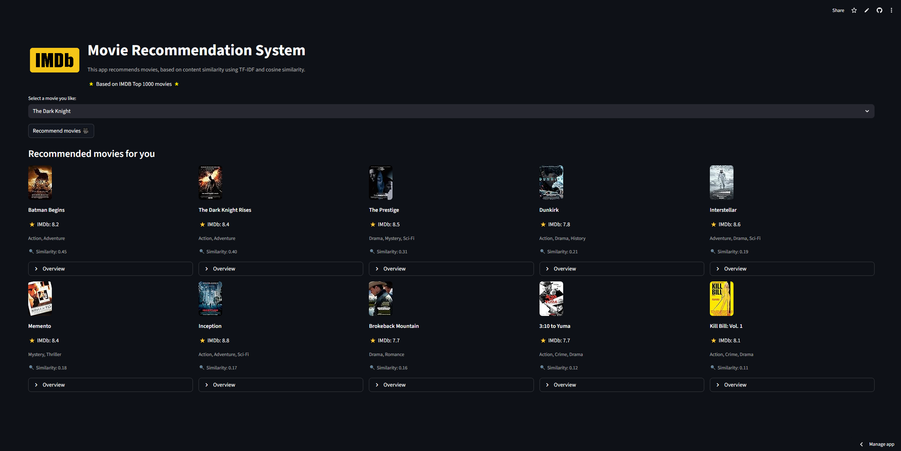

# 🎬 IMDb Movie Recommendation System

🚀 **Live Demo:** https://imdb-movie-recommendation-system-6afygoiegihggd5baxyqpy.streamlit.app/

A content-based movie recommendation system built using **TF-IDF** and **cosine similarity**,  
based on the **IMDb Top 1000 Movies dataset**.


## 🚀 Application Overview

This project is deployed as an interactive **Streamlit** application that allows users to:
- Select a movie they like
- Get top-N similar movie recommendations
- View IMDb ratings, genres, posters, and similarity scores
- Explore movie overviews directly within the app



---

## 🧠 Recommendation Approach

This project implements a **Content-Based Filtering** approach, which is a form of **unsupervised machine learning**.

### Techniques used:
- TF-IDF vectorization
- Cosine similarity
- Text-based feature engineering

The recommendation logic is based on **content similarity between movies**, not on user behavior or ratings prediction.

---

## 🔍 Explanation of Similarity Scores

The similarity score indicates **how similar two movies are in terms of content**, based on their textual information.

### How it works
- Each movie is converted into a numerical vector using **TF-IDF (Term Frequency–Inverse Document Frequency)**.
- Similarity between movies is computed using **cosine similarity**.
- The score ranges from **0 to 1**.

### Feature weighting
To better reflect the importance of certain attributes, some features are **intentionally weighted** by repeating them in the text representation before TF-IDF vectorization:

- **Director** → repeated **3×**
- **Genre** → repeated **2×**
- **Star 1** → repeated **2×**
- **Star 2** → repeated **2×**

This weighting strategy increases the influence of these features on the final similarity score, ensuring that movies sharing the same director, genre, or main actors are considered more similar.

### How to interpret the score

| Similarity Score | Interpretation |
|------------------|---------------|
| 0.00 – 0.20 | Very low similarity |
| 0.20 – 0.40 | Low similarity |
| 0.40 – 0.60 | Moderate similarity |
| 0.60 – 0.80 | High similarity |
| 0.80 – 1.00 | Very high similarity |

- A score close to **1** means the movies share very similar content.
- A score close to **0** means the movies have little to no content in common.

### Important notes
- Similarity scores are **relative**, not absolute.
- A score around **0.30–0.40** can still represent a meaningful recommendation within this dataset.
- Scores depend on the selected features (genre, overview, director, actors) and the TF-IDF configuration.

### Example
> If *The Dark Knight* and *Batman Begins* have a similarity score of **0.37**,  
> this indicates **moderate content similarity**, which is expected given shared themes, genre, and characters.

### Limitations
- The similarity score does **not measure movie quality or user preference**.
- It reflects **textual similarity only**.

---

## 📊 Dataset

This project uses the **IMDb Top 1000 Movies** dataset,  
**the same dataset used in the Power BI IMDb dashboard project**.

### Dataset files:
- `data/movies.csv` — original dataset from Kaggle
- `data/movies_cleaned.csv` — cleaned and preprocessed dataset used by the recommender system

### Source:
Kaggle – IMDb Top 1000 Movies and TV Shows  
https://www.kaggle.com/datasets/harshitshankhdhar/imdb-dataset-of-top-1000-movies-and-tv-shows

---

## 🛠 Tech Stack

- Python
- Pandas
- Scikit-learn
- Streamlit
- TF-IDF
- Cosine Similarity

---

## 📁 Project Structure

```
imdb-movie-recommendation-system/
│
├── app.py
├── recommender.py
├── data/
│   ├── movies.csv
│   └── movies_cleaned.csv
│
├── notebooks/
│   └── data_preprocessing.ipynb
│
├── assets/
│   └── imdb-logo.png
│
├── README.md
└── .gitignore
```
---

## 🌐 Deployment

The application is deployed using **Streamlit Community Cloud**.

Users can interact with the recommendation system directly from the browser:
- Select a movie
- Get similar movie recommendations
- Explore movie details and similarity scores

No local installation is required to use the live app.

---

## 📌 Notes

- This project focuses on content-based recommendation, not predictive modeling

- No collaborative filtering or user data is used

- Similarity scores represent cosine similarity between TF-IDF vectors

- The application is designed for demonstration and portfolio purposes

## 📬 Contact
[](https://www.linkedin.com/in/arounadrame/)
[](https://github.com/arounadrame)

Feel free to reach out for feedback, questions, or to discuss the project!
